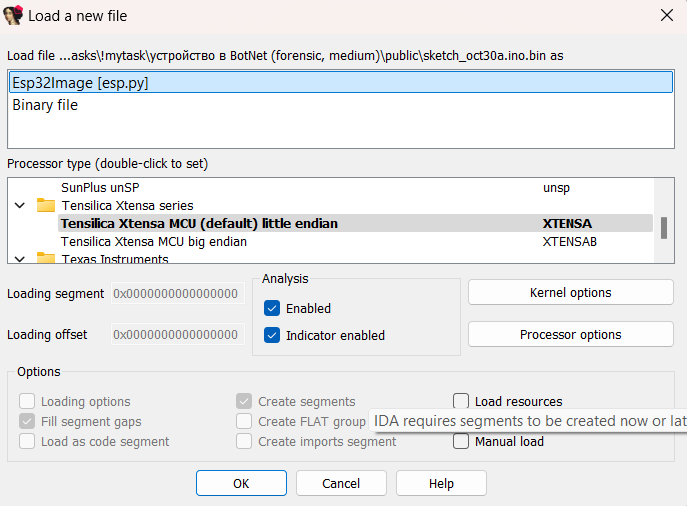
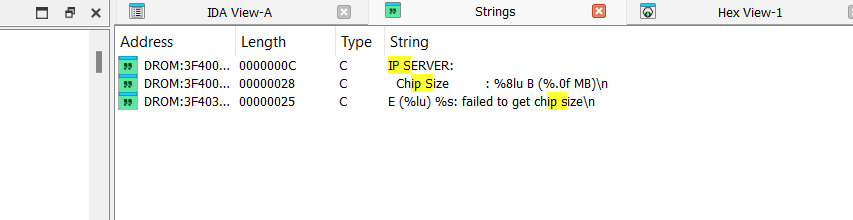
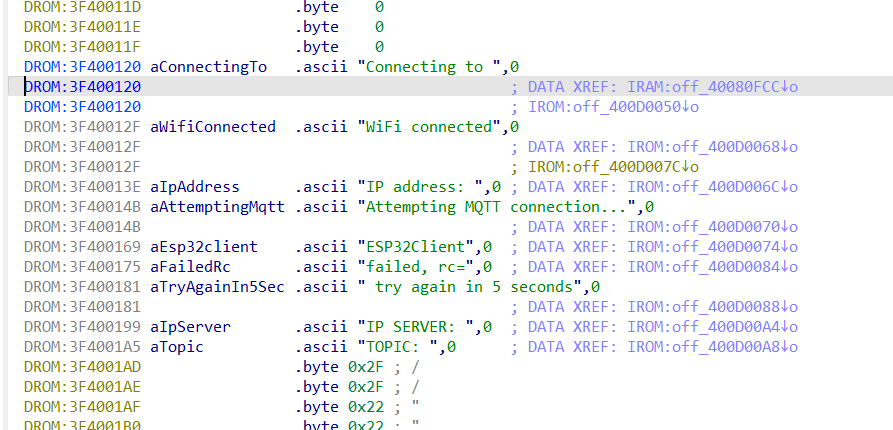
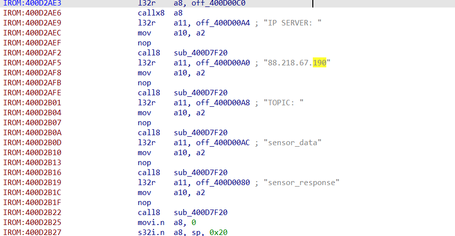
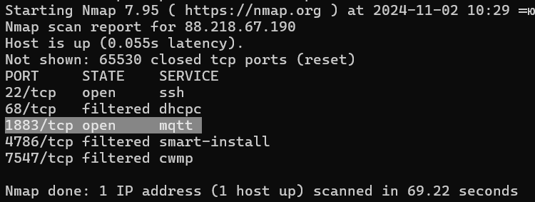
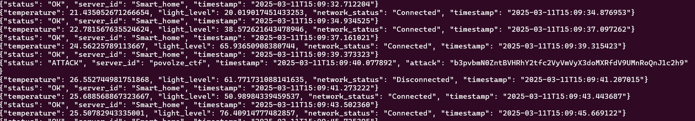
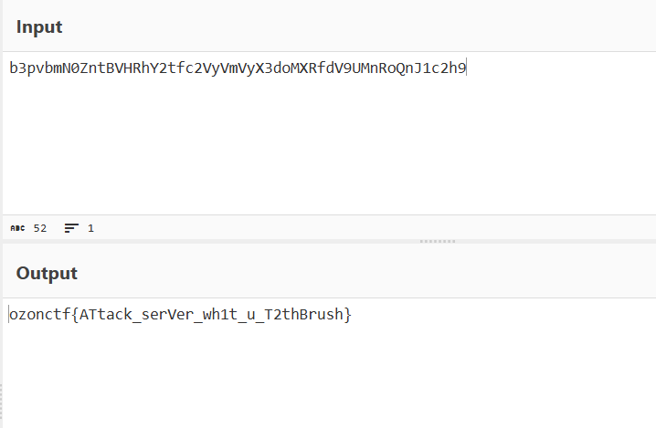

# BotNet | easy | forensic

## Информация

> Мы заказали на неком маркетплейсе (W) устройства умного дома, но что-то они начали плохо работать.
> Мы сейчас уезжаем, можешь посмотреть, пожалуйста?
> А, и да, на ПВЗ Ozon заберёшь посылку как раз.
>
> P.S. Нам удалось выяснить, что это ESP32.

## Деплой

```sh
cd deploy
docker compose up --build -d
``` 

## Выдать участинкам

Содержимое директории [public/](public/)


## Описание

Нужно декомпилировать бинарный файл, там найти данные для подключения к MQTT серверу. В топик, который используется для обратного общения с ESP32, иногда (раз в минуту) прилетает JSON словарь со статусом **ATTACK**, в значении **ATTACK_STRING** приходит флаг, зашифрованный в base64.


## Решение

Вводные данные: бинарник. 

Попробуем его декомпилировать в IDA. Используем библиотеку для esp.py.


Мы знаем, что это ESP, значит она подключается к какой-то сети и к какому-то серверу. Попробуем поизучать декомпилированный код и поискать похожие строки, что-нибудь похожее на **ip server**.

Находим строку **ip server** и переходим на нее. 

Видим, что он пытается куда-то подключиться. Давайте посмотрим, куда он ссылается.

Находим IP-адрес для подключения куда-то, но мы не видем в какие топики он пытается отправить показатели, пойдем поп ростому пути. Пойдем сканить IP на наличие открытых портов.

Видим два открытых порта — **22 (SSH)** и **1883 (MQTT сервер)**. Гуглим, как подключиться к нему.
Это можно сделать одной командой.
```sh
mosquitto_sub -h 82.202.143.88 -t "#" -P 'yourpassword' -u 'root'
```
c помощью # мы подписываемся на все топики и теперь мы будем видеть все сообщения проходящие через брокер


Видим, что идут какие-то пакеты: устройство отправляет и получает обратный ответ от сервера.

Если посмотреть чуть дольше, можно увидеть, что проходит какой-то странный пакет на сервер со статусом **ATTACK**. 
И если посмотреть ключ **attack**, то мы увидим какую-то строчку, напоминающую **base64**.

Декодируем её и получаем флаг.

## Флаг

`ozonctf{ATtack_serVer_wh1t_u_T2thBrush}`

