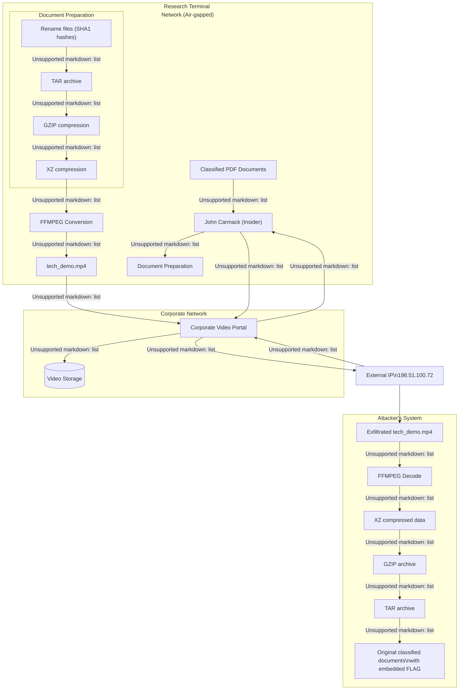

# Nuclear | hard | forensic 

## Информация
Секретные документы проекта HELIOS были переданы иностранным субъектам. Наша служба безопасности подтвердила, что утечка произошла изнутри нашей Сети Терминалов Исследований (СТИ). Озадачивает то, что СТИ — наша самая защищенная среда:

- Изолирована от интернета (air-gap)
- Запрещены USB и внешние носители
- Строгий контроль физического доступа
- **Единственная внешняя система, доступная с рабочих станций СТИ — наш корпоративный видеопортал**

Как ведущему эксперту по расследованию киберпреступлений, вам предоставлены записи сетевого трафика и системные журналы за предполагаемый период эксфильтрации данных. Ваша задача — определить, как были похищены данные и восстановить украденный документ, содержащий скрытый FLAG.

Удачной охоты.

# Решение

## Обзор

Это задание включает в себя обнаружение того, как злоумышленник внутри компании осуществил эксфильтрацию секретных данных ядерных исследований через корпоративный видеопортал. Решение требует сетевого форензик-анализа, изучения журналов и понимания того, как данные были скрыты внутри видеофайла.

## Шаг 1: Анализ журналов и выявление подозрительной активности

Начинаем исследование с анализа предоставленных журналов, чтобы выявить аномальное поведение.

### Анализ логов nginx

Используем утилиту `ripgrep` (команда `rg`) для быстрого поиска по журналам. Сначала ищем все POST-запросы, которые обычно связаны с загрузкой данных:
> [!NOTE]
>  Можно конечно искать обычым gnu/грепом, но вы будете кричать от боли

```bash
rg -i post nginx_access.log
```

Результаты поиска показывают множество POST-запросов, но особое внимание привлекают действия пользователя john.carmack:

```
# Вход пользователей
10.45.32.18 - john.doe [15/Jun/2023:10:10:00 +0000] "POST /login HTTP/1.1" 302 219 "http://video.nuclear.platform/" "Mozilla/5.0 (X11; Linux x86_64) AppleWebKit/537.36 (KHTML, like Gecko) Chrome/92.0.4515.107 Safari/537.36"
10.45.33.27 - alice.smith [15/Jun/2023:10:02:00 +0000] "POST /login HTTP/1.1" 302 219 "http://video.nuclear.platform/" "Mozilla/5.0 (Windows NT 10.0; Win64; x64) AppleWebKit/537.36 (KHTML, like Gecko) Chrome/91.0.4472.124 Safari/537.36"
10.45.34.102 - john.carmack [15/Jun/2023:10:04:00 +0000] "POST /login HTTP/1.1" 302 219 "http://video.nuclear.platform/" "Mozilla/5.0 (Windows NT 10.0; Win64; x64; rv:90.0) Gecko/20100101 Firefox/90.0"

# Загрузки файлов
10.45.32.18 - john.doe [15/Jun/2023:10:10:00 +0000] "POST /upload HTTP/1.1" 302 219 "http://video.nuclear.platform/upload-form" "Mozilla/5.0 (Windows NT 10.0; Win64; x64; rv:90.0) Gecko/20100101 Firefox/90.0"
10.45.33.27 - alice.smith [15/Jun/2023:10:15:00 +0000] "POST /upload HTTP/1.1" 302 219 "http://video.nuclear.platform/upload-form" "Mozilla/5.0 (X11; Linux x86_64) AppleWebKit/537.36 (KHTML, like Gecko) Chrome/92.0.4515.107 Safari/537.36"
10.45.34.102 - bob.jones [15/Jun/2023:10:20:00 +0000] "POST /upload HTTP/1.1" 302 219 "http://video.nuclear.platform/upload-form" "Mozilla/5.0 (Windows NT 10.0; Win64; x64; rv:90.0) Gecko/20100101 Firefox/90.0"
10.45.34.102 - john.carmack [15/Jun/2023:12:55:00 +0000] "POST /upload HTTP/1.1" 302 219 "http://video.nuclear.platform/upload-form" "Mozilla/5.0 (Windows NT 10.0; Win64; x64) AppleWebKit/537.36 (KHTML, like Gecko) Chrome/91.0.4472.124 Safari/537.36"

# Подозрительное удаление после загрузки
10.45.34.102 - john.carmack [15/Jun/2023:13:30:00 +0000] "POST /delete/95cbd303-1ee7-4a55-8dd4-1bcb1e515044 HTTP/1.1" 302 219 "http://video.nuclear.platform/my-videos" "Mozilla/5.0 (Macintosh; Intel Mac OS X 10_15_7) AppleWebKit/605.1.15 (KHTML, like Gecko) Version/14.1.1 Safari/605.1.15"
```

Видим подозрительную последовательность событий:
1. Пользователь john.carmack входит в систему
2. Позже он загружает файл
3. Затем он удаляет файл с определенным ID (95cbd303-1ee7-4a55-8dd4-1bcb1e515044)

Ищем дополнительную информацию об этом конкретном файле:

```bash
rg -i 95cbd303-1ee7-4a55-8dd4-1bcb1e515044 nginx_access.log
```

Результаты поиска:

```
198.51.100.72 - john.carmack [15/Jun/2023:13:15:00 +0000] "GET /download/95cbd303-1ee7-4a55-8dd4-1bcb1e515044 HTTP/1.1" 200 10712986 "http://video.nuclear.platform/my-videos" "Mozilla/5.0 (Windows NT 10.0; Win64; x64; rv:90.0) Gecko/20100101 Firefox/90.0"
10.45.34.102 - john.carmack [15/Jun/2023:13:30:00 +0000] "POST /delete/95cbd303-1ee7-4a55-8dd4-1bcb1e515044 HTTP/1.1" 302 219 "http://video.nuclear.platform/my-videos" "Mozilla/5.0 (Macintosh; Intel Mac OS X 10_15_7) AppleWebKit/605.1.15 (KHTML, like Gecko) Version/14.1.1 Safari/605.1.15"
```

Теперь картина становится яснее и более подозрительной:
1. john.carmack загружает файл
2. Файл скачивается с **внешнего IP-адреса** (198.51.100.72) — это ключевой момент, так как внешний IP не должен иметь доступа к секретной сети
3. После скачивания файл немедленно удаляется

### Анализ системных логов

Теперь исследуем системные логи, чтобы понять, какие действия предшествовали загрузке файла:

```bash
rg -i tar system.log
```

В системных логах обнаруживаем последовательность команд, выполненных john.carmack:

```
Jun 15 12:15:00 jumphost bash[12349]: COMMAND=tar -cf nuclear_research.tar * USER=john.carmack pid=31333 uid=1000 auid=1000 ses=42
Jun 15 12:20:00 jumphost bash[12350]: COMMAND=gzip -9 nuclear_research.tar USER=john.carmack pid=31334 uid=1000 auid=1000 ses=42
Jun 15 12:25:00 jumphost bash[12351]: COMMAND="BLOCK_SIZE=16; FRAME_WIDTH_MP4=1920; FRAME_HEIGHT_MP4=1080; FRAME_WIDTH=\$(echo \"\${FRAME_WIDTH_MP4}/\${BLOCK_SIZE}\" | bc); FRAME_HEIGHT=\$(echo \"\${FRAME_HEIGHT_MP4}/\${BLOCK_SIZE}\" | bc); MP4_HZ=60; MP4_FPS=60; FILE_SIZE=\$(stat -c%s nuclear_research.tar.gz); NEXT_SIZE=\$(echo \"(\$FRAME_WIDTH*\$FRAME_HEIGHT)\" | bc); { xz -1 -k nuclear_research.tar.gz --stdout; dd if=/dev/zero bs=\$NEXT_SIZE count=1; } | ffmpeg -y -f rawvideo -pix_fmt monob -video_size \${FRAME_WIDTH}x\${FRAME_HEIGHT} -r \${MP4_HZ} -i \"pipe:0\" -vf scale=iw*\${BLOCK_SIZE}:ih*\${BLOCK_SIZE} -sws_flags neighbor -r \${MP4_FPS} -pix_fmt yuv420p -preset superfast \"tech_demo.mp4\"" USER=john.carmack pid=31335 uid=1000 auid=1000 ses=42
```

Анализируя эти команды, можем восстановить полную цепочку действий злоумышленника:

1. Создание директории `secret` для сбора данных
2. Поиск и копирование всех PDF-файлов в эту директорию
3. Переименование файлов с использованием SHA1-хешей для скрытия их реального содержимого
4. Создание TAR-архива из всех собранных файлов
5. Сжатие архива с помощью gzip
6. Использование сложной команды ffmpeg для преобразования сжатого архива в видеофайл

Последняя команда представляет особый интерес, так как она раскрывает механизм сокрытия данных в видеофайле.

## Шаг 2: Понимание механизма сокрытия данных в видеофайле

Внимательно анализируя команду ffmpeg из системных логов, можно понять алгоритм преобразования данных в видео:

```bash
BLOCK_SIZE=16; 
FRAME_WIDTH_MP4=1920; 
FRAME_HEIGHT_MP4=1080; 
FRAME_WIDTH=$(echo "${FRAME_WIDTH_MP4}/${BLOCK_SIZE}" | bc); 
FRAME_HEIGHT=$(echo "${FRAME_HEIGHT_MP4}/${BLOCK_SIZE}" | bc); 
MP4_HZ=60; 
MP4_FPS=60; 
FILE_SIZE=$(stat -c%s nuclear_research.tar.gz); 
NEXT_SIZE=$(echo "($FRAME_WIDTH*$FRAME_HEIGHT)" | bc); 
{ xz -1 -k nuclear_research.tar.gz --stdout; dd if=/dev/zero bs=$NEXT_SIZE count=1; } | ffmpeg -y -f rawvideo -pix_fmt monob -video_size ${FRAME_WIDTH}x${FRAME_HEIGHT} -r ${MP4_HZ} -i "pipe:0" -vf scale=iw*${BLOCK_SIZE}:ih*${BLOCK_SIZE} -sws_flags neighbor -r ${MP4_FPS} -pix_fmt yuv420p -preset superfast "tech_demo.mp4"
```

Разберем алгоритм по шагам:

1. **Подготовка параметров**:
   - `BLOCK_SIZE=16` — размер блока в пикселях
   - `FRAME_WIDTH_MP4=1920, FRAME_HEIGHT_MP4=1080` — размеры финального видео
   - `FRAME_WIDTH, FRAME_HEIGHT` — размеры до масштабирования 
   - `MP4_HZ=60, MP4_FPS=60` — параметры частоты кадров видео


2. **Подготовка данных**:
   - Сжатие архива с помощью XZ (`xz -1 -k nuclear_research.tar.gz --stdout`)
   - Добавление нулевых байтов (`dd if=/dev/zero bs=$NEXT_SIZE count=1`) для заполнения последнего кадра

3. **Преобразование в видео**:
   - Данные интерпретируются как монохромные кадры (черно-белые пиксели)
   - Каждый байт данных превращается в 8 монохромных пикселей (1 бит = 1 пиксель)
   - Результат кодируется в формат MP4 с кодеком H.264

Важно отметить, что этот метод позволяет скрыть бинарные данные любого типа внутри видеофайла, что делает его идеальным для эксфильтрации. Обычные системы предотвращения утечек данных (DLP) не распознают секретные данные в таком виде.


## Шаг 3: Извлечение MP4-файла из PCAP

Следующий шаг — извлечение MP4-файла из захваченного PCAP. Это можно сделать, используя функцию Wireshark "Export Objects":

Перейдите в меню File > Export Objects > HTTP
Найдите HTTP-ответ, содержащий tech_demo.mp4 (ищите файл большого размера)
Сохраните файл

Или используйте инструменты из репозитория scripts4kids (среднее время выполнения питон кода - 2 года)
```bash
./extract_uploads.py exfiltration_capture.pcap
```

Результат выполнения скрипта:
```
Extracted MP4 file: quarterly_report_2023.mp4 (size: 10,712,986 bytes)
Extracted MP4 file: product_launch_video.mp4 (size: 5,623,695 bytes)
Extracted MP4 file: team_meeting_recording.mp4 (size: 42,445,131 bytes)
Extracted MP4 file: tech_demo.mp4 (size: 90,079,895 bytes)
Extraction complete. 4 file(s) extracted.
```

Скрипт обнаружил 4 MP4-файла в PCAP. Файл `tech_demo.mp4` размером более 90 МБ соответствует тому, который упоминался в системных логах и был загружен john.carmack.

Для получения более подробной информации о файле используем `exiftool`:

```bash
exiftool tech_demo.mp4
```

Результат:
```
ExifTool Version Number         : 13.25
File Name                       : tech_demo.mp4
Directory                       : .
File Size                       : 90 MB
...
Image Width                     : 1920
Image Height                    : 1072
...
Compressor Name                 : Lavc61.19.100 libx264
Bit Depth                       : 24
...
```

Эта информация подтверждает, что файл является видео с параметрами, близкими к тем, что мы видели в команде ffmpeg.

## Шаг 4: Разработка метода обратного декодирования

На основе понимания алгоритма кодирования создаем скрипт для обратного процесса:

```bash
#!/bin/bash
# Те же параметры, что использовались при кодировании
BLOCK_SIZE=16
FRAME_WIDTH_MP4=1920
FRAME_HEIGHT_MP4=1080
FRAME_WIDTH=$(echo "${FRAME_WIDTH}/${BLOCK_SIZE}" | bc)
FRAME_HEIGHT=$(echo "${FRAME_HEIGHT}/${BLOCK_SIZE}" | bc)
MP4_HZ=60
MP4_FPS=60

ffmpeg -y -i "./tech_demo.mp4" -r ${MP4_FPS} -f rawvideo -pix_fmt monob -vf "scale=iw/${BLOCK_SIZE}:ih/${BLOCK_SIZE}" -video_size ${FRAME_WIDTH}x${FRAME_HEIGHT} -sws_flags neighbor -r ${MP4_HZ} pipe:1 | xz -d --stdout > outputfile
```

Принцип работы скрипта:

1. **Декодирование видео**:
   - Извлечение кадров из MP4 с помощью ffmpeg
   - Масштабирование обратно к оригинальному размеру
   - Преобразование в монохромный формат

2. **Обратное преобразование**:
   - Полученные монохромные кадры представляют собой бинарные данные
   - Эти данные передаются декодеру xz для распаковки
   - Результат сохраняется в файл outputfile

Запускаем скрипт:
```bash
./mp42file.sh
```

Вывод ffmpeg показывает, что обработка идет успешно:
```
ffmpeg version n7.1 Copyright (c) 2000-2024 the FFmpeg developers
...
Input #0, mov,mp4,m4a,3gp,3g2,mj2, from './tech_demo.mp4':
...
  Duration: 00:05:54.42, start: 0.000000, bitrate: 2033 kb/s
  Stream #0:0[0x1](und): Video: h264 (High) (avc1 / 0x31637661), yuv420p(progressive), 1920x1072, 2027 kb/s, 60 fps, 60 tbr, 15360 tbn (default)
...
frame=21265 fps=1960 q=-0.0 Lsize=   20870KiB time=00:05:54.41 bitrate= 482.4kbits/s speed=32.7x    
```

## Шаг 5: Анализ восстановленных данных

После выполнения скрипта анализируем полученный файл:

```bash
file outputfile
```

Результат:
```
outputfile: gzip compressed data, was "9016fdbf96f0351dd01831073a12b3fa55aed32b", last modified: Wed Apr  2 19:18:52 2025, from Unix, original size modulo 2^32 29245440
```

Мы получили gzip-архив с оригинальным именем "9016fdbf96f0351dd01831073a12b3fa55aed32b". Это совпадает с нашими выводами из анализа логов о том, что данные были сжаты gzip.

Для дополнительного анализа используем `binwalk`:

```bash
binwalk outputfile
```

Результат:
```
DECIMAL    HEXADECIMAL        DESCRIPTION
-----------------------------------------------------------------------------------------
0          0x0                gzip compressed data, original file name: "9016fdbf96f0351dd01831073a12b3fa55aed32b", operating system: Unix, timestamp: 2025-04-02 19:18:52, total size: 21754722 bytes
```

Для извлечения содержимого используем 7-Zip:

```bash
7z x outputfile
```

Получаем файл с именем "9016fdbf96f0351dd01831073a12b3fa55aed32b". Анализируем его:

```bash
binwalk 9016fdbf96f0351dd01831073a12b3fa55aed32b
```

Результат:
```
DECIMAL    HEXADECIMAL        DESCRIPTION
-----------------------------------------------------------------------------------------
0          0x0                POSIX tar archive, file count: 16
```

Теперь распаковываем TAR-архив:

```bash
tar -xvf 9016fdbf96f0351dd01831073a12b3fa55aed32b
```

В результате получаем 16 файлов с хеш-именами:
```
0ba2141b8996a615d7484536d7a97c27a1768407
15bf32f916d5bac58ccbe43d8588737c51511dff
19c4daee218dcb580bd0c8feb85baceb4dc08462
38cb9653b89f7cb63ef1a84947a571535ce7a5e7
578d2217424d9e30fcc77620dc2e3d24633e13ea
0606af4790260b25c6250d948fb0636198aa609d
646ccbcbec32d4c4d6b79fec0d4267e2bb170cc7
09153ecb59afc5ab878add23e7956fe074de1653
a12186fb482a8318c33bcf97e5b8a800f3e7fb82
aa7290bf1e293c230575409fa1321306b4533cf4
b481c4f70bde83ace148977b1ba8739c9da280af
bdb37bd9c75c8b223dc46aa71c3d0f79eaafad14
c8b2ead3f78f075b27fa0ca20fbc7d43272707b7
d849d60ad587a89c804d2bbd5faa04e7cdd69cb9
e30662b25d7c003b8f52cccd82314ff83925c751
ef54ad4f59f002a762758b6b6f0c764a49342cbc
```

## Шаг 6: Анализ восстановленных файлов и поиск флага

Определяем типы файлов и переименовываем PDF для удобства:

```bash
find . -maxdepth 1 -type f -print0 | xargs -0 -I{} sh -c 'if file "$1" | grep -q "PDF document"; then mv "$1" "$1.pdf"; fi' _ {}
```

Среди файлов обнаруживаем текстовый файл:

```bash
file 19c4daee218dcb580bd0c8feb85baceb4dc08462
```

Результат:
```
19c4daee218dcb580bd0c8feb85baceb4dc08462: Unicode text, UTF-8 text
```

Для более удобного поиска конвертируем PDF в текстовые файлы:

```bash
find . -maxdepth 1 -type f -name "*.pdf" -print0 | xargs -0 -I {} sh -c 'pdftotext "{}" "{}.txt"'
```

Теперь ищем возможные упоминания флага:

```bash
rg -i flag
```

Результат:
```
19c4daee218dcb580bd0c8feb85baceb4dc08462
835:   - OzonCTF good job, you solved hardest stage, you're very close to get the flag
ef54ad4f59f002a762758b6b6f0c764a49342cbc.pdf.txt
913:4. Flagg, E.E. : Analytical Procedure and Computer Program for Determining the
mp42file.sh
11:ffmpeg -y -i "./tech_demo.mp4" -r ${MP4_FPS} -f rawvideo -pix_fmt monob -vf "scale=iw/${BLOCK_SIZE}:ih/${BLOCK_SIZE}" -video_size ${FRAME_WIDTH}x${FRAME_HEIGHT} -sws_flags neighbor -r ${MP4_HZ} pipe:1 | xz -d --stdout > outputfile
system.log
2828:Jun 15 12:25:00 jumphost bash[12351]: COMMAND="BLOCK_SIZE=16; FRAME_WIDTH_MP4=2000; FRAME_HEIGHT_MP4=2000; ...
```

В файле `19c4daee218dcb580bd0c8feb85baceb4dc08462` мы видим подсказку, что мы близки к флагу. Ищем точный формат флага:

```bash
rg -i ozonctf
```

Результат:
```
19c4daee218dcb580bd0c8feb85baceb4dc08462
835:   - OzonCTF good job, you solved hardest stage, you're very close to get the flag
c8b2ead3f78f075b27fa0ca20fbc7d43272707b7.pdf.txt
1326:OzonCTF{N3uTr0n_Flu5H_C0nT41nM3nT_Br34CH_XJ721}
```

Флаг найден в файле `c8b2ead3f78f075b27fa0ca20fbc7d43272707b7.pdf.txt`:
```
OzonCTF{N3uTr0n_Flu5H_C0nT41nM3nT_Br34CH_XJ721}
```

## Схема процесса эксфильтрации

Теперь, когда мы полностью раскрыли механизм эксфильтрации, можем представить полную схему:


Процесс эксфильтрации состоял из следующих этапов:

1. **Подготовка данных**:
   - Сбор секретных PDF-документов
   - Переименование файлов с использованием хеш-функции SHA1 для скрытия их содержимого
   - Создание TAR-архива из всех файлов
   - Сжатие архива с помощью gzip, затем дополнительное сжатие с помощью xz

2. **Стеганография в видео**:
   - Преобразование сжатых бинарных данных в последовательность черно-белых кадров
   - Каждый бит данных становится одним пикселем (0 = черный, 1 = белый)
   - Масштабирование кадров для создания видео стандартного размера
   - Кодирование в MP4 с использованием H.264, что делает видео неотличимым от обычного

3. **Эксфильтрация**:
   - Загрузка видеофайла на корпоративный видеопортал (единственную доступную внешнюю систему)
   - Скачивание файла с внешнего IP-адреса
   - Удаление файла с сервера для сокрытия следов

4. **Восстановление данных (процесс, который мы выполнили)**:
   - Декодирование видео обратно в бинарные данные
   - Распаковка с использованием xz и gzip
   - Извлечение файлов из TAR-архива
   - Анализ восстановленных файлов для обнаружения флага

## флаг
`OzonCTF{N3uTr0n_Flu5H_C0nT41nM3nT_Br34CH_XJ721}`
