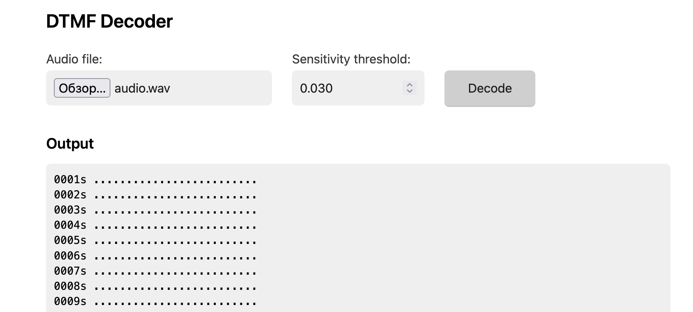
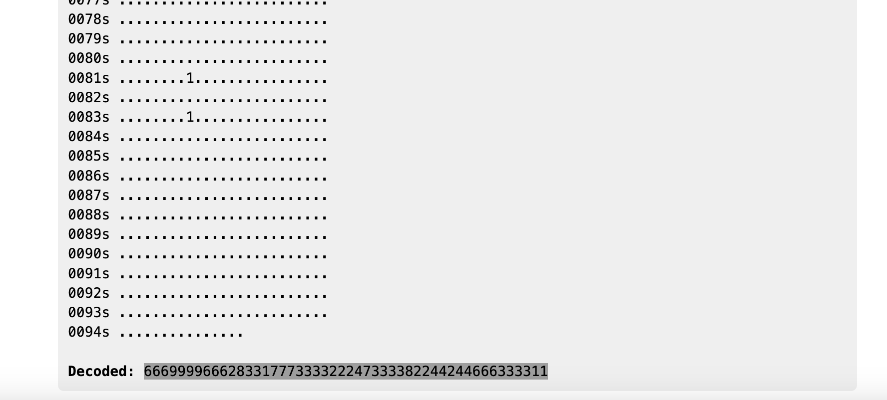
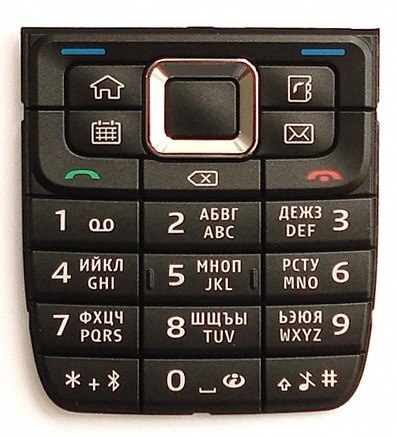

# Spy Family | hard | forensic

## Информация

Гоша-гусь, наш лучший курьер, как всегда вовремя доставил посылки на секретный склад СТИ. Но в этот раз что-то пошло не так...

На днях пропали чертежи нового гипердвигателя, а незадолго до этого взяли нового работника - какой-то странный тип, вечно ходит в тёмных очках и бормочет что-то про "прекрасный далёкий".

Вчера Гоша случайно подслушал, как этот тип звонил жене со служебного терминала:

Говорил что-то про "голубей" и "погоду" Упоминал "кофемашины" (хотя у нас только чайники!) Какие-то странные цифры называл Гоша записал этот разговор. Разберись, не передавал ли он секретные данные под видом обычного разговора!

## Выдать участинкам

Дамп [`Dump_system_22032025.wav`](public/Dump_system_22032025.wav) из директории [public/](public/)

## Описание

Участнику необходимо прогнать аудио через dtmf детектор и поправить количество нажатых кнопок вручную. Далее декодировать и получится флаг.

## Решение

При прослушивании явно выйдут на первый план писки, которые являются звуками нажатия цифровой клавиатуры старых кнопочных телефонов. В интернете существует множество детекторов, что же было нажато по звуку, например [dtmf.netlify.app](https://dtmf.netlify.app), советую сразу опустить порог чувствительности до 0.030:

Получилась данная строка: `666999966628331777333322247333382244244666333311`.

Дальше начинается магия декодировки, первоначально стоит попробовать разобрать существующую строку, будто бы она верно определена. Для этого возьмём картинку телефона из интернета(либо если вы настоящий гик, у вас найдётся свой телефон):

- 666 - o
- 9999 - z
- 666 - o
- 2 - a
- 8 - t
- 33 - e
- 1 - .
- 777 - r
- 3333 - 3 (Тут надо либо вспоминать, либо вычитывать, как набрать цифру в сообщениях данного телефона)
- 222 - c
- 4 - g
- 7 - p
- 3333 - 3
- 8 - t
- 22 - b
- 44 - h
- 2 - a
- 44 - h
- 666 - o
- 3333 - 3
- 11 - ,

Получилась непонятная строка, но в её начале можно заметить `ozo*t*.` - очень похоже на начало флага, если предположить, что за `.` была взята фигурная скобка открытия. Попробуем избавиться от лишних символов и добавить нераспознанные – к сожалению, здесь программно сделать это будет сложнее, чем руками. Поэтому запасаемся терпением и, включив звук будет считать правильное количество нажатий. Дополнительно учтём, что звуки, относящиеся к одной букве собраны в группу из одинаковых звуков, что вполне различимо, однако автоматический детектор мог ошибиться, и добавил лишние цифры в перечень. После данного анализа, должна получиться такая строка: `66699996666622283331777733332227773333812224444446666333311111`. Разберём её:

- 666 - o
- 9999 - z
- 666 - o
- 66 - n (догадываемся на основе шаблона флага ozonctf{})
- 222 - c
- 8 - t
- 333 - f
- 1 - . (Но, зная флаг заменим на `{`)
- 7777 - s
- 3333 - 3
- 222 - c
- 777 - r
- 3333 - 3
- 8 - t
- 1 - . (Пока не знаем, но можем предположить `_`, так как некий символ внутри флага, а флаг похож на читаемое словосочетание)
- 222 - c
- 44 - h
- 4444 - 4 (На записи слышно, что между ними есть разрыв)
- 66 - n
- 66 - n (На записи слышно, что между ними есть разрыв)
- 3333 - 3
- 1111 - 1 (На разных телефонах по разному, но из читаемости флага нам не хватает буквы `l`, а самое близкое к ней либо `!`, либо `1`)
- 1 - . (Но так как конец сообщения, можем смело брать за `}`)

Собирая всё вместе получится искомый флаг.

## Флаг

`ozonctf{s3cr3t_ch4nn31}`

