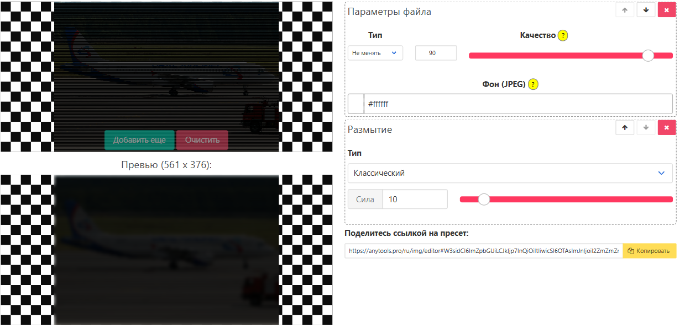
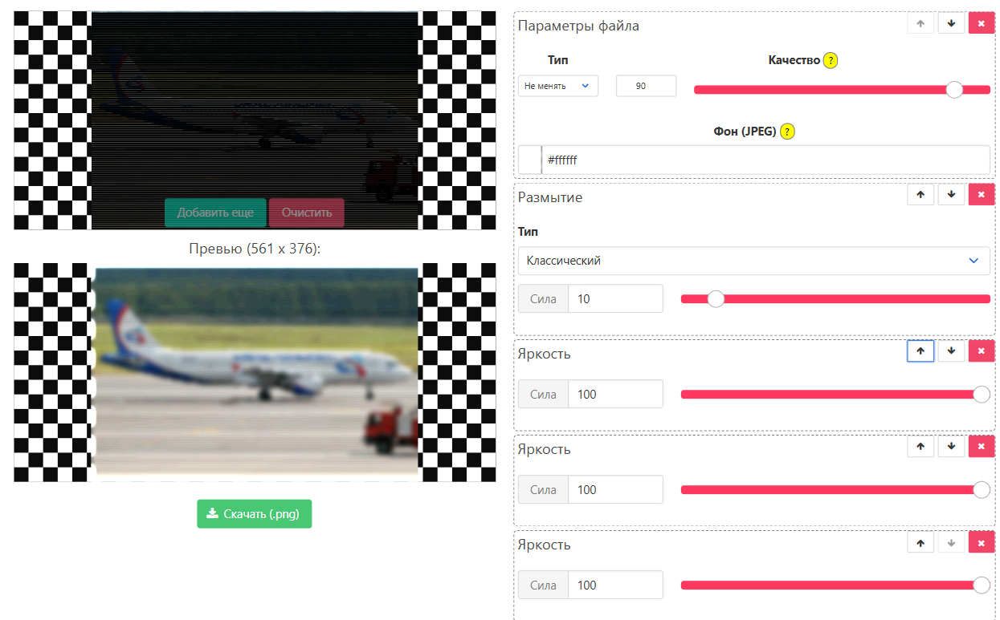
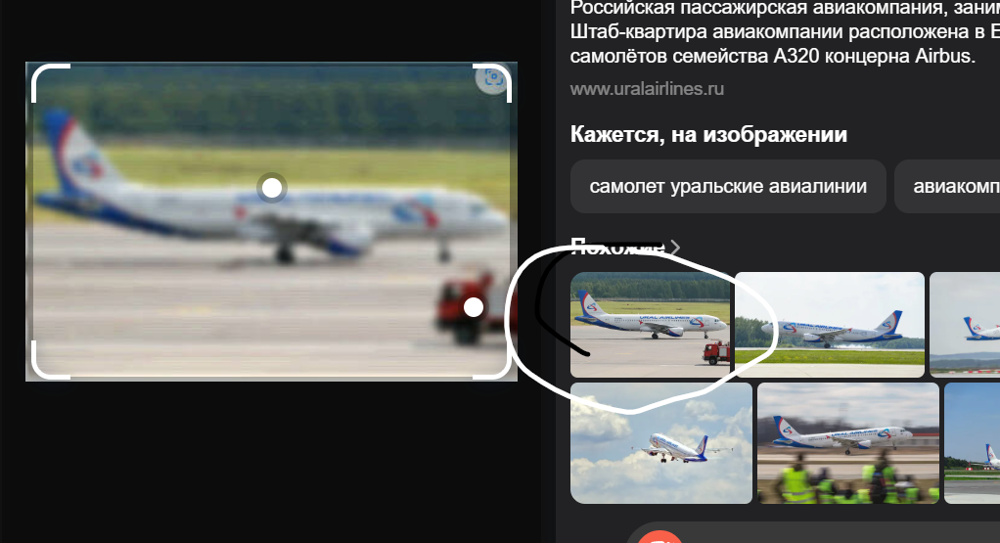
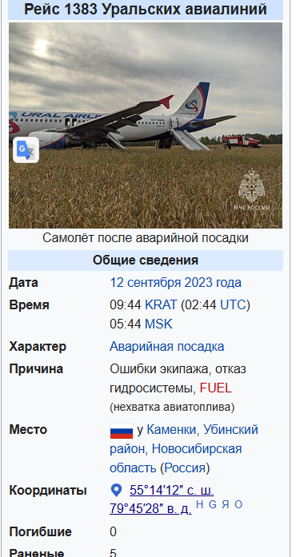

# nwe_plain | Easy | Osint

## Информация

> Ты говоришь, что это твой самолет? Тогда ты должен знать, где он сейчас.
>
> Так скажи, где он в данный момент.
>
> **ozonctf{xx.xxxxxx_yy.yyyyyy}**

## Выдать участникам

Фото из директории [public/](public/).

## Описание

Задача заключается в восстановлении изображения таким образом, чтобы его можно было распознать с помощью поисковых систем (Яндекс/Google).

## Решение

Для решения воспользуемся [сайтом](https://anytools.pro/ru/img/editor), который позволяет применять различные фильтры к изображениям.

### 1. Размытие изображения

На изображении присутствует множество полос. Для их уменьшения можно применить эффект размытия:



После применения размытия линии становятся менее заметными, но изображение остается темным.

### 2. Увеличение яркости

Добавляем свет, используя фильтр "Яркость":



Теперь самолет стал более различимым.

### 3. Поиск по изображению

Загружаем обработанное изображение в Яндекс:



Видим, что поиск дал совпадения. Можно еще сделать небольшой акцент на машину, не на всех изображениях он так стоит.

### 4. Анализ результатов

Открываем найденные источники и обнаруживаем, что изображение используется в статье [на Википедии](https://en.m.wikipedia.org/wiki/File:Ural_Airlines,_VP-BMW,_Airbus_A320-214_(21365622235).jpg).

Изучаем страницу и выясняем, что фотография использовалась в статье об авиакатастрофе под Новосибирском:


В разделе "Общие сведения" находим координаты происшествия:



Координаты даны в формате широты и долготы. Преобразуем их в нужный формат и сдаем флаг.

## Флаг

```ozonctf{55.236670_79.757780}```

