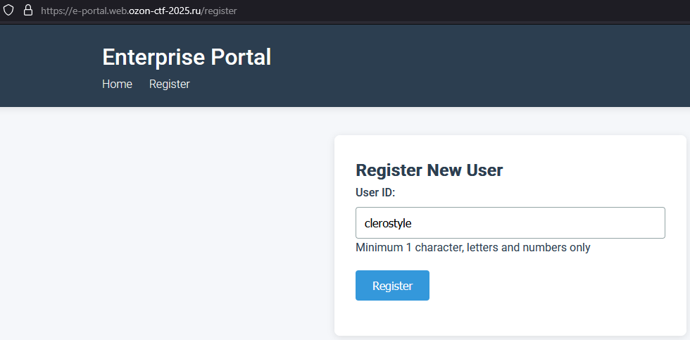
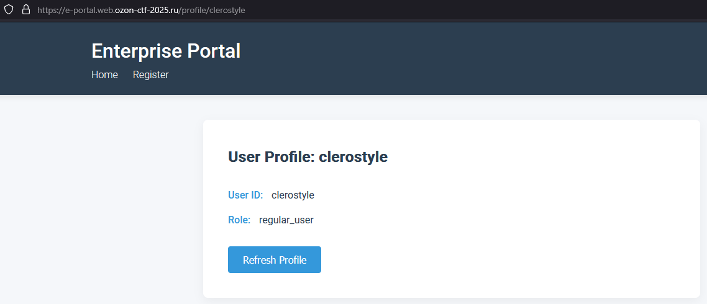
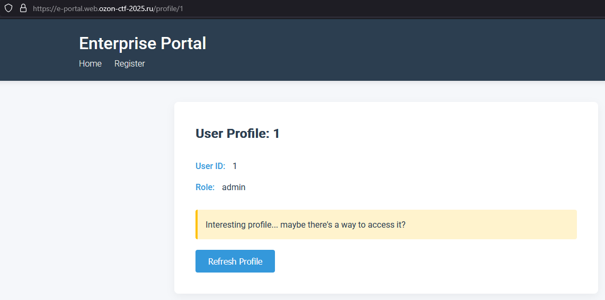
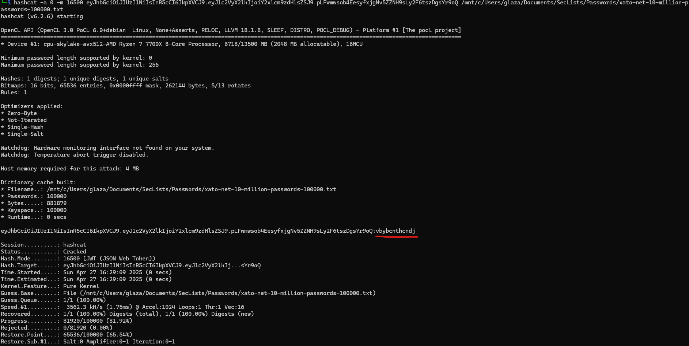
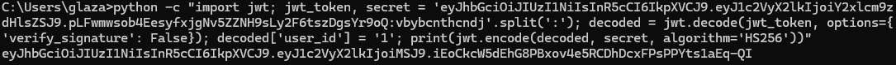
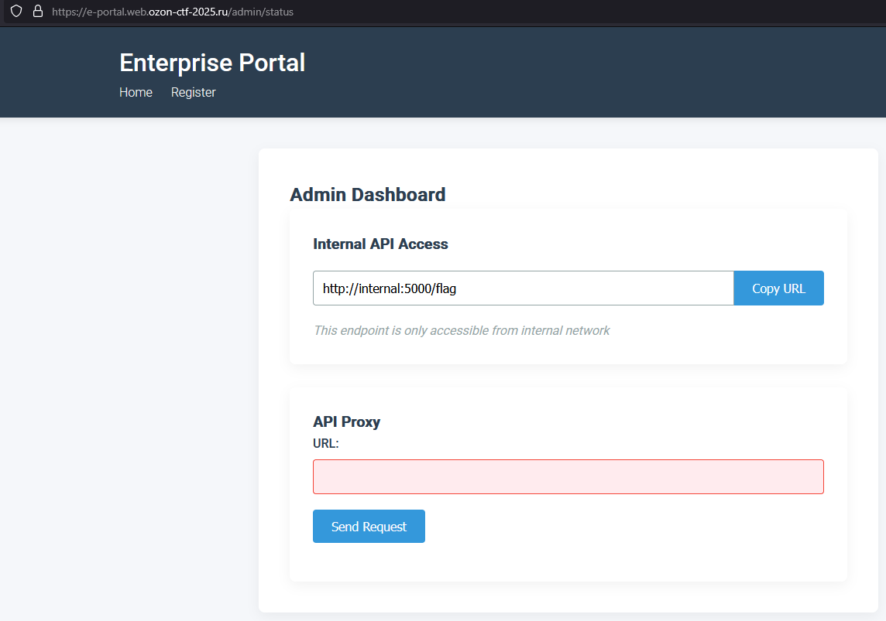
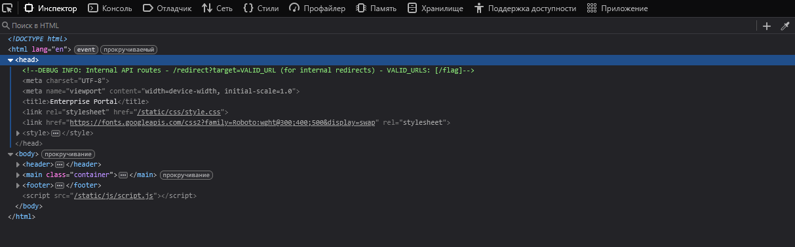
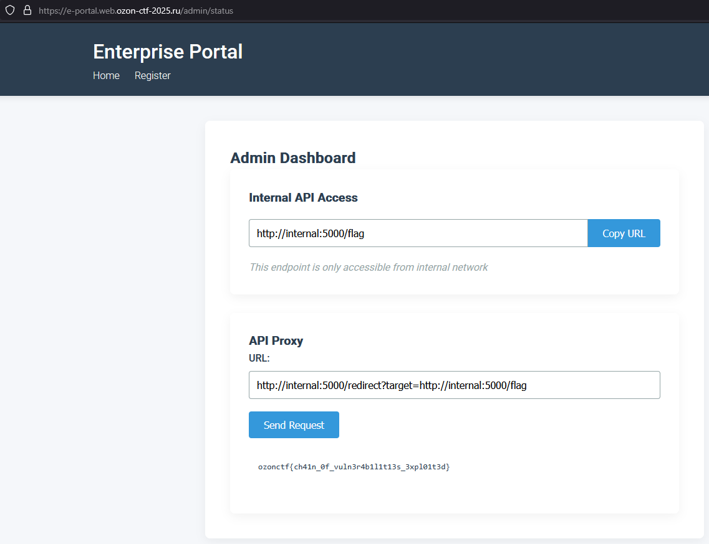

# Enterprice Portal | hard | web

## Информация

> Компания недавно написала свой супер безопасный корпоративный портал, пойди посмотри на него сам
>
> http://<ip>:8010

## Деплой

Указываем команду необходимую для запуска задачи на сервере

```sh
cd deploy
docker-compose up --build -d
```

## Выдать участинкам

IP:PORT сервера

## Описание

Корпоративный портал содержит несколько взаимосвязанных уязвимостей, позволяющих эскалировать привилегии и получить доступ к защищенным данным.

## Решение

При заходе на сайт видим форму регистрации.



После регистрации видим эндпоинт /account/{id}
Нужно найти ID администратора через IDOR в `/profile/<id>`


Затем нужно подделать JWT-токен на администратора, используя слабый секрет



Через админ-панель узнаем о внутреннем API


В комментариях фронтэнда видим странный эндпоинт на internal api `/redirect`


Используем SSRF с обходом ограничений через `/redirect`
Получаем флаг через цепочку редиректов - http://internal:5000/redirect?target=http://internal:5000/flag


## Флаг

`ozonctf{ch41n_0f_vuln3r4b1l1t13s_3xpl01t3d}`