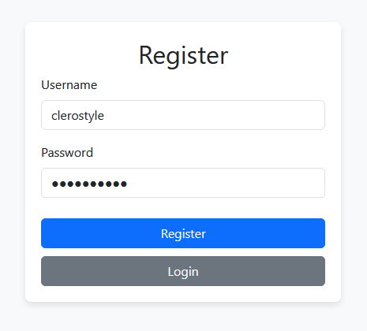
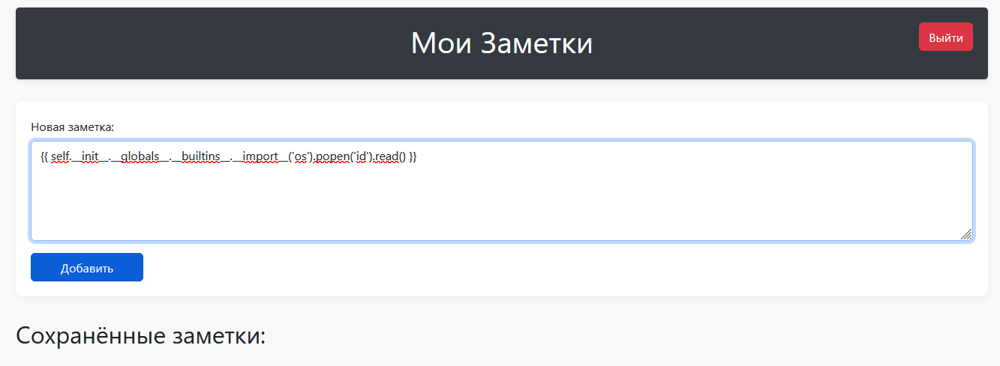
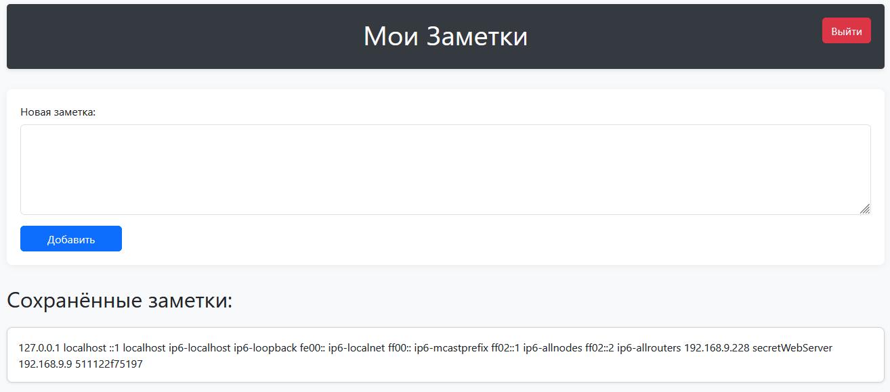
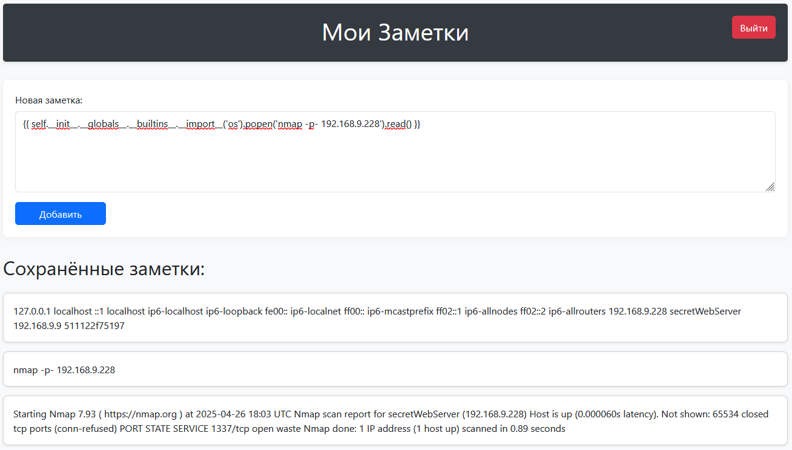
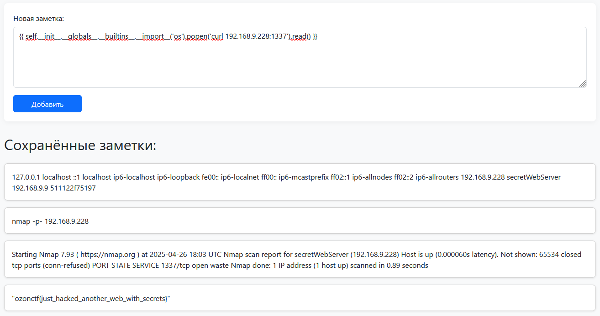

# Secret Web | medium | web

## Информация

"Представляю вам новый сервис с заметками! Это инновация в сфере безопасности. Никто его не сможет взломать :) А ещё у меня там рядом еще один сервис где-то лежит"

"Та хоспаде, когда это уже закончится", - это были единственные мысли Гоши

https://secret.web.ozon-ctf-2025.ru


## Деплой

Указываем команду необходимую для запуска задачи на сервере

```sh
cd deploy
docker-compose up --build -d
```

## Выдать участинкам

IP:PORT сервера

## Описание

Сервис с заметками

## Решение

При заходе на сайт видим регистрацию, регаемся


Затем в форму закидываем пэйлоад SSTI Jinja2


После смотрим файл /etc/hosts


Находим там айпишник 192.168.9.228
Сканим у него порты через nmap


Находим порт 1337. Через curl стучимся на сервис и получаем флаг


## Флаг

`ozonctf{just_hacked_another_web_with_secrets}`